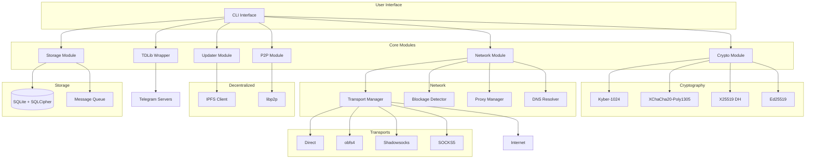
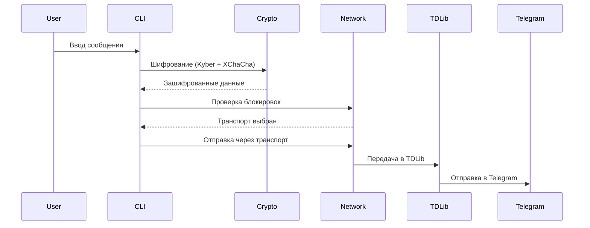
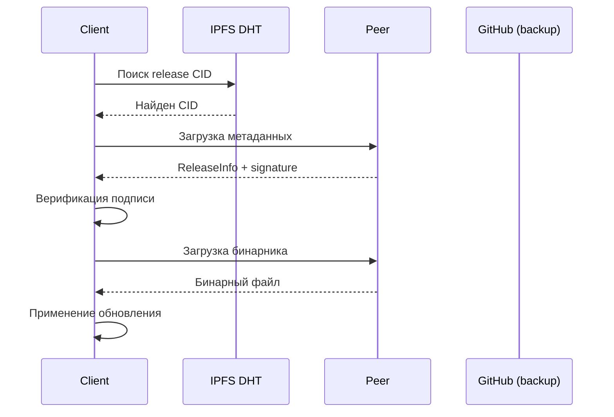

# 📐 Архитектура Secure Telegram Client v2.0

## 1. Общая схема архитектуры



## 2. Модули

### 2.1 Crypto Module (`src/crypto/`)

**Назначение**: Постквантовое и классическое шифрование

| Компонент | Файл | Статус |
|-----------|------|--------|
| Kyber-1024 | `kyber.rs` | ✅ Готово |
| XChaCha20-Poly1305 | `xchacha.rs` | ✅ Готово |
| X25519 DH | `dh.rs` | ✅ Готово |
| Ed25519 | В разработке | ⏳ Planned |

### 2.2 Network Module (`src/network/`)

**Назначение**: Управление транспортами и обход блокировок

| Компонент | Файл | Статус |
|-----------|------|--------|
| Transport Manager | `transport.rs` | 🟡 Заготовка |
| Blockage Detector | `blockage_detector.rs` | 🟡 Заготовка |
| Proxy Manager | `proxy_manager.rs` | 🟡 Заготовка |
| DNS Resolver | `dns_resolver.rs` | 🟡 Заготовка |

### 2.3 P2P Module (`src/p2p/`)

**Назначение**: Fallback коммуникация через libp2p

| Компонент | Файл | Статус |
|-----------|------|--------|
| P2P Client | `client.rs` | 🟡 Заготовка |
| Gossipsub | В разработке | ⏳ Planned |
| mDNS | В разработке | ⏳ Planned |

### 2.4 Storage Module (`src/storage/`)

**Назначение**: Безопасное хранение данных

| Компонент | Файл | Статус |
|-----------|------|--------|
| Message Queue | `message_queue.rs` | ✅ Готово |
| SQLCipher | В разработке | ⏳ Planned |

### 2.5 Updater Module (`src/updater/`)

**Назначение**: Децентрализованные обновления

| Компонент | Файл | Статус |
|-----------|------|--------|
| IPFS Updater | `ipfs_updater.rs` | ✅ Готово |
| GitHub Backup | `github.rs` | ✅ Готово |
| Signature Verify | В разработке | ⏳ Planned |

## 3. Поток данных

### 3.1 Отправка сообщения



### 3.2 Обновление через IPFS



## 4. Зависимости (Cargo.toml)

### Критические
```toml
# Криптография
pqcrypto-kyber = "0.7.0"          # Постквантовый KEM
chacha20poly1305 = "0.10"         # AEAD шифрование
x25519-dalek = "2.0"              # Key exchange
ed25519-dalek = "2.0"             # Signatures

# P2P
libp2p = "0.53"                   # P2P фреймворк
ipfs-api-backend-hyper = "0.6"    # IPFS клиент

# Сеть
tokio-socks = "0.5"               # SOCKS5 прокси
reqwest = "0.11"                  # HTTP клиент

# Хранение
rusqlite = "0.29"                 # SQLite с SQLCipher
```

### Обоснование выбора

1. **libp2p**: Стандарт де-факто для P2P, модульная архитектура
2. **IPFS**: Децентрализованное хранение, устойчивость к цензуре
3. **Kyber-1024**: NIST стандартизированный постквантовый алгоритм
4. **XChaCha20-Poly1305**: Быстрое AEAD шифрование без патентов
5. **SQLCipher**: Прозрачное шифрование SQLite баз

## 5. План внедрения

### Этап 1: MVP (v0.2.0) - Текущая

- ✅ Базовая криптография
- ✅ TDLib интеграция
- ✅ CLI интерфейс
- ✅ Конфигурация
- ✅ IPFS updater (базовый)
- 🟡 Transport manager (SOCKS5)

**Срок**: Q1 2024

### Этап 2: Anti-Censorship (v0.3.0)

- ⏳ obfs4 реализация
- ⏳ Shadowsocks интеграция
- ⏳ Blockage detector (DNS/TCP/TLS)
- ⏳ DNS over HTTPS
- ⏳ TLS fingerprint evasion

**Срок**: Q2 2024

### Этап 3: P2P Fallback (v0.4.0)

- ⏳ libp2p полная интеграция
- ⏳ Gossipsub месседжинг
- ⏳ Message queue с шифрованием
- ⏳ mDNS для локальной сети
- ⏳ Mesh режим (Bluetooth/Wi-Fi)

**Срок**: Q3 2024

### Этап 4: Production (v1.0.0)

- ⏳ Security аудит
- ⏳ Performance оптимизация
- ⏳ GUI клиент (Tauri)
- ⏳ Мобильная версия
- ⏳ Полная документация

**Срок**: Q4 2024

## 6. Тест-кейсы

### 6.1 Тесты на блокировки

```rust
#[cfg(test)]
mod blockage_tests {
    #[test]
    fn test_dns_blockage_detection() {
        // Проверка детекта DNS блокировок
    }

    #[test]
    fn test_tcp_reset_detection() {
        // Проверка детекта TCP RST инъекций
    }

    #[test]
    fn test_tls_fingerprint_analysis() {
        // Анализ TLS fingerprint
    }
}
```

### 6.2 Тесты транспортов

```rust
#[test]
fn test_transport_auto_switch() {
    // Автоматическое переключение при блокировке
}

#[test]
fn test_obfs4_obfuscation() {
    // Проверка obfs4 обфускации
}
```

### 6.3 Тесты P2P

```rust
#[tokio::test]
async fn test_p2p_message_delivery() {
    // Доставка сообщений через P2P
}

#[tokio::test]
async fn test_mesh_network_formation() {
    // Формирование mesh сети
}
```

## 7. Безопасность

### Реализовано

- ✅ Постквантовое шифрование (Kyber-1024)
- ✅ AEAD шифрование (XChaCha20-Poly1305)
- ✅ Подпись релизов (Ed25519)
- ✅ Шифрование БД (SQLCipher)

### Требует реализации

- ⚠️ obfs4 (только заглушка)
- ⚠️ Shadowsocks (только заглушка)
- ⚠️ TLS fingerprint evasion
- ⚠️ P2P end-to-end шифрование

### Известные ограничения

1. Ключи хранятся локально (нет HSM)
2. Нет защиты от memory dump
3. P2P режим без полного E2EE

## 8. Производительность

### Бенчмарки

Запуск:
```bash
cargo bench
```

### Целевые показатели

| Операция | Цель | Текущее |
|----------|------|---------|
| Шифрование 1MB | <100ms | 🟡 TBD |
| Расшифровка 1MB | <100ms | 🟡 TBD |
| Подключение через прокси | <5s | 🟡 TBD |
| P2P message delivery | <1s | ⏳ TBD |

---

**Документ создан**: 2024-02-27
**Версия**: v2.0
**Статус**: В разработке
