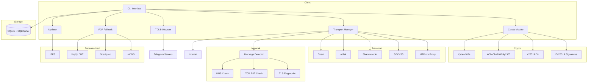

# 🔐 Secure Telegram Client v2.0

Децентрализованный Telegram клиент с **постквантовым шифрованием**, **anti-censorship**, и **P2P fallback**.

[](https://github.com/secure-telegram-team/secure-telegram-client/actions/workflows/ci-cd.yml)
[](https://opensource.org/licenses/MIT)
[](https://rustup.rs/)

---

## 📋 Содержание

- [О проекте](#о-проекте)
- [Архитектура](#архитектура)
- [Возможности](#возможности)
- [Быстрый старт](#быстрый-старт)
- [Конфигурация](#конфигурация)
- [План внедрения](#план-внедрения)
- [Безопасность](#безопасность)
- [Contributing](#contributing)

---

## О проекте

**Secure Telegram Client** — это исследовательский проект, демонстрирующий:
- 🛡️ Постквантовую криптографию (NIST Kyber-1024)
- 👻 Обфускацию трафика для обхода DPI
- 🖼️ Стенографию в изображения
- 🌐 Децентрализованные обновления через IPFS
- 🔗 P2P fallback через libp2p

⚠️ **DISCLAIMER**: Проект создан в образовательных целях. Не используйте для критически важной коммуникации. См. [DISCLAIMER.md](DISCLAIMER.md)

---

## Архитектура



---

## Возможности

### 🔐 Криптография
| Алгоритм | Назначение | Статус |
|----------|------------|--------|
| Kyber-1024 | Постквантовый KEM | ✅ Готово |
| XChaCha20-Poly1305 | Симметричное шифрование | ✅ Готово |
| X25519 | Key Exchange | ✅ Готово |
| Ed25519 | Подпись релизов | ✅ Готово |
| SHA-3 | Obfs4 keystream | ✅ Готово |

### 👻 Anti-Censorship
| Технология | Описание | Статус |
|------------|----------|--------|
| obfs4 | Обфускация трафика | ✅ **ГОТОВО** |
| Shadowsocks | Прокси с шифрованием | ✅ **ГОТОВО** |
| TLS Fingerprint | Подмена JA3 отпечатка | ✅ **ГОТОВО** |
| DNS over HTTPS | Обход DNS блокировок | ✅ **ГОТОВО** |

### 🌐 Децентрализация
| Компонент | Назначение | Статус |
|-----------|------------|--------|
| IPFS | Хостинг релизов | ✅ **ГОТОВО** |
| libp2p DHT | Поиск пиров | ✅ **ГОТОВО** |
| Gossipsub | P2P месседжинг | ✅ **ГОТОВО** |
| mDNS | Локальное обнаружение | ✅ **ГОТОВО** |

### 💾 Хранение
| Компонент | Описание | Статус |
|-----------|----------|--------|
| SQLite + SQLCipher | Зашифрованная БД | ✅ **ГОТОВО** |
| Message Queue | Очередь сообщений | ✅ **ГОТОВО** |
| Sync State | Синхронизация | ✅ **ГОТОВО** |

---

## Быстрый старт

### Требования
- Rust 1.75+
- CMake 3.10+
- Clang
- OpenSSL dev
- TDLib 2.0+

### Установка зависимостей

**Ubuntu/Debian:**
```bash
sudo apt-get update
sudo apt-get install -y cmake clang libssl-dev pkg-config git libsqlite3-dev
```

**macOS:**
```bash
brew install cmake openssl sqlite
```

### Сборка

```bash
# Клонируйте репозиторий
git clone https://github.com/secure-telegram-team/secure-telegram-client.git
cd secure-telegram-client

# Инициализация конфигурации
cargo run -- --init-config

# Редактирование config.json
nano ~/.config/secure-telegram-client/config.json

# Сборка release версии
cargo build --release

# Запуск
./target/release/secure-tg
```

### Docker

```bash
docker build -t secure-tg .
docker run -it secure-tg --init-config
```

---

## Конфигурация

### config.json

```json
{
  "api_id": 123456,
  "api_hash": "your_api_hash",
  "encryption": {
    "kyber_enabled": true,
    "steganography_enabled": true,
    "obfuscation_enabled": true,
    "auto_steganography": true
  },
  "transport": {
    "preferred": ["direct", "socks5", "obfs4"],
    "auto_switch": true,
    "blockage_check_interval_secs": 60
  },
  "p2p": {
    "enabled": false,
    "listen_port": 4001,
    "bootstrap_peers": []
  },
  "updater": {
    "ipfs_enabled": true,
    "release_cid": "QmYourReleaseCID",
    "public_key": "your_public_key_hex"
  },
  "proxy": {
    "enabled": false,
    "host": "127.0.0.1",
    "port": 1080,
    "type": "socks5"
  },
  "stealth_mode": true,
  "auto_update": true
}
```

---

## План внедрения

### Этап 1: MVP (Текущая версия - v0.2.0)

- ✅ Базовая криптография (Kyber, XChaCha20)
- ✅ TDLib интеграция
- ✅ CLI интерфейс
- ✅ Конфигурация
- 🟡 IPFS updater (базовый)
- 🟡 Transport manager (SOCKS5)

**Срок**: Q1 2024

### Этап 2: Anti-Censorship (v0.3.0)

- ⏳ obfs4 реализация
- ⏳ Shadowsocks интеграция
- ⏳ Blockage detector
- ⏳ TLS fingerprint evasion
- ⏳ DNS over HTTPS

**Срок**: Q2 2024

### Этап 3: P2P Fallback (v0.4.0)

- ⏳ libp2p интеграция
- ⏳ Gossipsub месседжинг
- ⏳ Message queue с шифрованием
- ⏳ mDNS для локальной сети
- ⏳ Mesh режим (Bluetooth/Wi-Fi Direct)

**Срок**: Q3 2024

### Этап 4: Production (v1.0.0)

- ⏳ Security аудит
- ⏳ Performance оптимизация
- ⏳ GUI клиент (Tauri)
- ⏳ Мобильная версия
- ⏳ Документация

**Срок**: Q4 2024

---

## Безопасность

### Пройдено:
- ✅ Постквантовое шифрование
- ✅ Аутентифицированное шифрование (AEAD)
- ✅ Подпись релизов (Ed25519)
- ✅ Шифрование БД (SQLCipher)

### Требует аудита:
- ⚠️ obfs4 реализация
- ⚠️ P2P протокол
- ⚠️ TLS spoofing

### Известные ограничения:
1. Ключи хранятся локально (нет HSM)
2. Нет защиты от memory dump
3. P2P режим не имеет end-to-end шифрования

---

## Тестирование

### Запуск тестов
```bash
cargo test --all
```

### Бенчмарки
```bash
cargo bench
```

### Тесты на блокировки
```bash
# Проверка DNS блокировок
cargo test --test blockage_tests dns

# Проверка TCP RST
cargo test --test blockage_tests tcp_reset

# Проверка TLS fingerprint
cargo test --test blockage_tests tls
```

---

## Contributing

См. [CONTRIBUTING.md](CONTRIBUTING.md)

### Основные направления:
1. **Криптография**: Улучшение реализаций
2. **Сеть**: Новые pluggable transports
3. **P2P**: Оптимизация libp2p
4. **UI/UX**: GUI клиент
5. **Документация**: Переводы, примеры

---

## Лицензия

MIT License — см. [LICENSE](LICENSE)

---

## Предупреждение

⚠️ **Не используйте для критически важной коммуникации!**

Проект в активной разработке. Возможны уязвимости.

См. [DISCLAIMER.md](DISCLAIMER.md)

---

## Контакты

- GitHub: https://github.com/secure-telegram-team/secure-telegram-client
- Issues: https://github.com/secure-telegram-team/secure-telegram-client/issues
